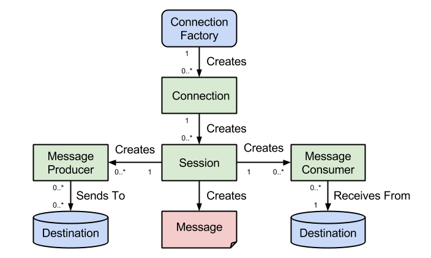

# Basic JMS examples

Some example of the JMS consumer and producer API and implementation considerations.

## Pre-requisites

Be sure to have access to Active MQ artemis broker, in docker or on a cluster.

## Major JMS concepts

The basic api can be summarized in the following diagram from `codenotfound.com`



* ConnectionFactory is used to create JMS connection to the provider. It needs the broker URL, username and password.
* Connection is the encapsulation to the TCP/IP socket between the client and the provider. Always close connection to avoid congestion on the Provider side.
* A session is a single-threaded context for producing and consuming messages. A session provides a transactional context with which to group a set of sends and receives into an atomic unit of work.
* A MessageProducer is an object that is created by a session and used for sending messages to a destination
* A MessageConsumer is an object that is created by a session and used for receiving messages
* Destination is a queue or a topic
* Message includes metadata.

A client can have multiple connections and in a connection can have multiple sessions. Each session can have producer, consumer or both. So a client can go to different destinations: queues and topics. 

## Producing text message


In JMS 1.1 producer.send() blocks untile remote peer acknowledges delivery. But JMS 2.0, support asynchronous send with CompletionListener. New classes are added like JMSProducer, and JMSConsumer which are lightweight, and have operations to access message properties and to support chaining.  

 In JMS 2.0, the JMSContext implements the AutoCloseable interface, so no need to call the close() operation, if the creation of the JMSContext is in try with resources and catch.

```
```

See JMS 2.0 API specifics in [this document](https://www.oracle.com/technetwork/articles/java/jms20-1947669.html).


## Vert.x 
