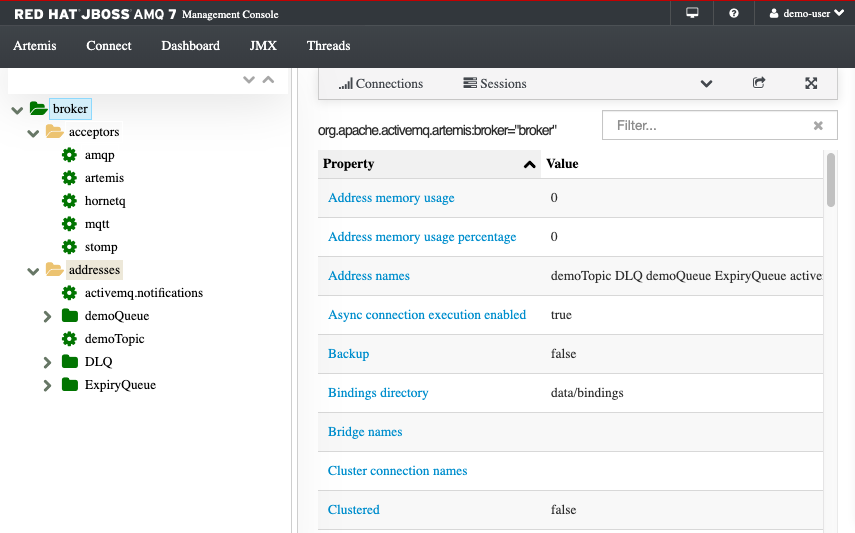
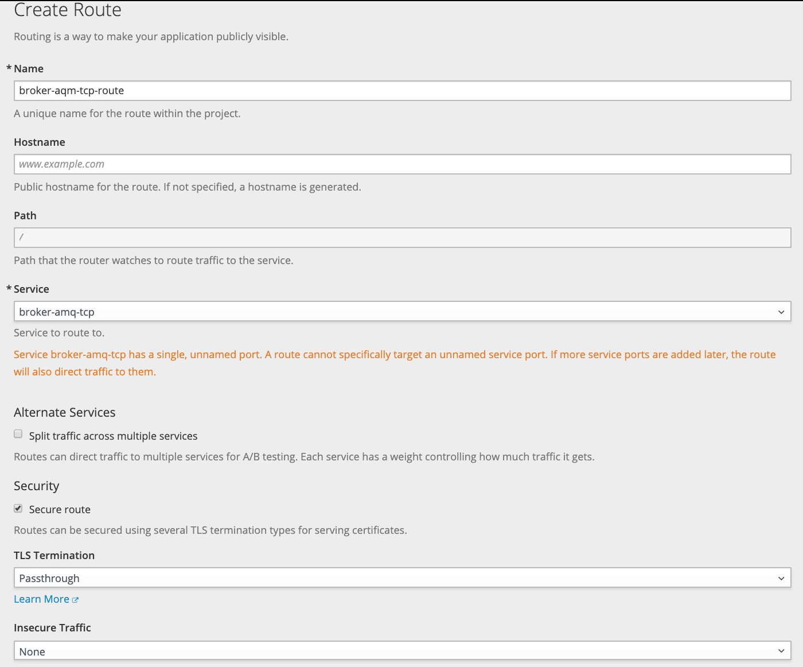

# AMQ Deployments

## Run Active MQ Artemis locally using docker

Download tar file from [https://activemq.apache.org/components/artemis/download/](https://activemq.apache.org/components/artemis/download/). Unzip and then set the $ARTEMIS_HOME environment variable to the folder containing artemis. (e.g. < somewhere>/apache-artemis-2.10.0)

Clone the official docker files for ubuntu or centos from this github: [https://github.com/apache/activemq-artemis](https://github.com/apache/activemq-artemis).

The do the steps described in this repository README. We built the centos image:

```
docker build -f ./docker/Dockerfile-centos -t artemis-centos .
```
Start with the command:
```
docker run -it -p 61616:61616 -p 8161:8161 -v $ARTEMIS_HOME/instance:/var/lib/artemis-instance artemis-centos 


Or you can run the broker in the background using:

   "/var/lib/artemis-instance/bin/artemis-service" start

     _        _               _
    / \  ____| |_  ___ __  __(_) _____
   / _ \|  _ \ __|/ _ \  \/  | |/  __/
  / ___ \ | \/ |_/  __/ |\/| | |\___ \
 /_/   \_\|   \__\____|_|  |_|_|/___ /
 Apache ActiveMQ Artemis 2.10.0


2019-09-06 16:03:45,113 INFO  [org.apache.activemq.artemis.integration.bootstrap] AMQ101000: Starting ActiveMQ Artemis Server

```

Access the ActiveMQ admin-console as usual. Just invoke `http://localhost:8161/` artemis/artemis

The artemis management console looks like:


The next step is to test with an application, for that see [this note]().

## Running on Openshift

You may follow the [instructions](https://access.redhat.com/documentation/en-us/red_hat_amq/7.4/html-single/deploying_amq_broker_on_openshift_container_platform/index#installing-broker-ocp_broker-ocp) for the last AMQ release: at the time of writing it was 7.4. 

The things to do:

* Install AMQ broker image and application templates on Openshift namespace to make them available globally.
* Deploy AMQ broker
     * select a specific project
     * create service account: 
          ```
          echo '{"kind": "ServiceAccount", "apiVersion": "v1", "metadata": {"name": "amq-service-account"}}' | oc create -f -
          ```
     * Add the view role to the service account.
          ```
          oc policy add-role-to-user view system:serviceaccount:amq-demo:amq-service-account
          ```
     * Define security certificates: you need broker keystore, a client keystore, and a client truststore that includes the broker keystore. The examples below are for Java client.
          ```
          # Generate a self-signed certificate for the broker keystore
          keytool -genkey -alias broker -keyalg RSA -keystore broker.ks
          # Export the certificate so that it can be shared with clients:
          keytool -export -alias broker -keystore broker.ks -file broker_cert
          # Generate a self-signed certificate for the client keystore:
          keytool -genkey -alias client -keyalg RSA -keystore client.ks
          # Create a client truststore that imports the broker certificate:
          keytool -import -alias broker -keystore client.ts -file broker_cert
          # Export the client’s certificate from the keystore:
          keytool -export -alias client -keystore client.ks -file client_cert
          # Import the client’s exported certificate into a broker SERVER truststore:
          keytool -import -alias client -keystore broker.ts -file client_cert
          ```
     * Use the broker keystore file to create the AMQ Broker secret
          ```
          oc create secret generic amq-app-secret --from-file=broker.ks
          # Add the secret to the service account created earlier:
          oc secrets add sa/amq-service-account secret/amq-app-secret
          ```
     * Create a new broker application, based on the template for a basic broker
          ```
          oc new-app amq-broker-74-basic -p AMQ_PROTOCOL=openwire,amqp,stomp,mqtt,hornetq -p AMQ_USER=amquser -pAMQ_PASSWORD=password -p AMQ_QUEUES=demoQueue -p AMQ_ADDRESSES=demoTopic
          ```
          which create brokers with the different protocols. The URL end point is defined as a new route and with different service endpoints. The URL is something like `http://console-greencompute.apps.green-with-envy.ocp.csplab.local/` which needs to be known in your DNS or /etc/hosts.
          The different protocol end points are visible with `oc status`
          ```
          svc/broker-amq-mqtt - 172.30.205.38:1883
          svc/broker-amq-stomp - 172.30.128.123:61613
          svc/broker-amq-tcp - 172.30.153.208:61616
          svc/broker-amq-amqp - 172.30.227.85:5672
          ```

          Once deployed the console presents the queue and topic configuration:

          

     * Create a SSL route to allow inbound traffic to AMQ broker using SSL.
          

