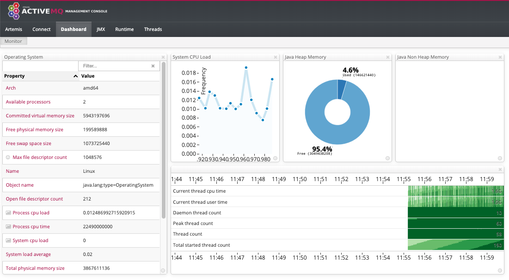

# AMQ Deployments

## Run local using docker

Classical Active MQ
```
 docker run -d  \
    --name activemq -p 8161:8161 -p 61616:61616 -p 61613:61613 \
    -p 61617:61617 smaject/activemq
```
Matching dockerfile is [here](https://hub.docker.com/r/smaject/activemq/dockerfile) where we can see the different exposed ports. 

Access the ActiveMQ admin-console as usual. Just invoke `http://localhost:8161/admin/` admin/admin

For the Artemis version 
```
docker run -it -p 61616:61616 -p 8161:8161 -v <broker folder on host>:/var/lib/artemis-instance artemis-centos 
docker run -d -e 'ARTEMIS_MIN_MEMORY=1512M' -e 'ARTEMIS_MAX_MEMORY=3048M' -e ARTEMIS_USERNAME=admin -e ARTEMIS_PASSWORD=password -p 61616:61616 -p 8161:8161 vromero/activemq-artemis
```

The artemis management console:



## Running on Openshift
