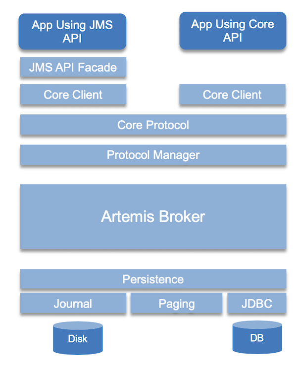
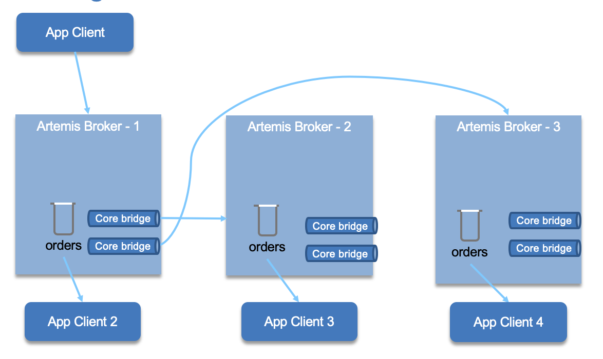

# AMQ Studies

[Apache Active MQ](https://activemq.apache.org/) started in 2004 as the first open source JMS specification implementation but has evolved to a event driven architecture backbone, with peristence, massive scalability and high availability. It is a big product with a lot of features.
It is now in two flavors: classic and artemis. Artemis is the new architecture.

## Characteristics

* Heterogeneous application integration
    * Java,  C/C++, .NET, Perl, PHP, Python, Ruby
* JMS compliant from design
* pub / sub and point-to-point communication style. With Topic, subscription may be *durable* which means they retain a copy of each message sent to the topic until the subscriber consumes them 
* Guarantee the mesage will be delivered once and only once to each consumer of a queue or a durable topic.
* Support the sending and acknowledgement of multiple messages in a single local transaction
* Support XA transaction in Java using JTA
* Message can be persisted in permanent storage, and will survice server crashes and restart.
* Support HTTP/S via REST call, STOMP, MQTT, AMQT
* Provide clustering model where messages can be intelligently load balanced between the servers in the cluster, according to the number of consumers on each node, and whether they are ready for messages

## Architecture

The following diagram illustrates the component of Active MQ Artemis architecture for a standalone broker:



* Each broker server is a Java POJO.
* Broker configuration is defined in a `broker.xml` file and control clustering, how to access it, and how it connect to other servers, but also its queues and topics.
* A broker instance, is the result of starting a broker process, and is the directory containing all the configuration and runtime data, such as logs and data files, associated with a broker process.
* Use persistent journal to persist messages on disk. It is possible to plug a JDBC and remote database. (This experimental)
* Client applications can interact with any protocol which are mapped to Core protocol. JMS API has a provider that uses the core client library.
* Broker always just deals with core API interactions.
* The normal stand-alone messaging broker configuration comprises a core messaging broker and a number of protocol managers that provide support for the various protocols

### Clustering

It is possible to group brokers so they can share the message processing and support high availability. Each server within the cluster manages its own messages and handles its own connections. Cluster is formed by each node declaring cluster connections to other nodes in the `broker.xml` configuration file or by using dynamic cluster discovery using broadcast technics like UDP multicast.

Cluster connections allow messages to flow between the nodes of the cluster to balance load. The connector elements specifies how the broker can be accessed. ActiveMQ uses [Netty](https://netty.io/) for serving different network protocols

```xml
<connectors>
    <connector name="netty-connector">tcp://localhost:61616</connector>
</connectors>
```

When the broker starts, it shares its connection configuration with client or other servers using a broadcast address/port defined in a `broadcast-group`

```xml
<broadcast-groups>
  <broadcast-group name="my-broadcast-group">
     <group-address>${udp-address:231.7.7.7}</group-address>
     <group-port>9876</group-port>
     <broadcast-period>100</broadcast-period>
     <connector-ref>netty-connector</connector-ref>
  </broadcast-group>
</broadcast-groups>
```

*broadcast-period* is the period in milliseconds between consecutive broadcasts. *connector-ref* specifies the connector and optional backup connector that will be broadcasted as data to other servers.

To support dynamic server discovery each broker needs to define discovery group.  A **discovery group** defines how connector information is received from a broadcast endpoint. The target broker keeps a list of server -> connectors to build the cluster topology dynamically. group-address: is the multicast IP address of the group to listen on. It should match the group-address in the broadcast group that you wish to listen from. refresh-timeout: is the period the discovery group waits after receiving the last broadcast from a particular server before removing that servers connector pair entry from its list.

```xml
<discovery-groups>
   <discovery-group name="my-discovery-group">
       <group-address>${udp-address:231.7.7.7}</group-address>
       <group-port>9876</group-port>
       <refresh-timeout>10000</refresh-timeout>
   </discovery-group>
</discovery-groups>
```



A single node can belong to multiple clusters simultaneously. Cluster connections group servers into clusters so that messages can be load balanced between the nodes of the cluster. The declaration in the broker.xml may include the following:

```xml
<cluster-connections>
    <cluster-connection name="my-cluster">
      <connector-ref>netty-connector</connector-ref>
      <retry-interval>500</retry-interval>
      <use-duplicate-detection>true</use-duplicate-detection>
      <message-load-balancing>STRICT</message-load-balancing>
      <max-hops>1</max-hops>
      <discovery-group-ref discovery-group-name="my-discovery-group"/>
 </cluster-connection>
 </cluster-connections>

```

`connector-ref` is the connector which will be sent to other nodes in the cluster so they have the correct cluster topology. `retry-interval` determines the interval in ms between retry to connect to a failed broker. Remember there are core bridges transparently created when defining cluster connection.

`use-duplicate-detection` helps to avoid message duplication, by adding an identificator in the message, so duplicate.

`message-load-balancing` determines how messages will be distributed between other nodes of the cluster. It can be one of three values - OFF, STRICT, or ON_DEMAND. The forward is on the same queue as the master node. ON_DEMAND will forward only if the other broker(s) has consumers with filters matching the message to send.

Finally, the discovery group is used to obtain the list of other servers in the cluster that this cluster connection will make connections to.


### High Availability

Clustering addresses part of the high availability requirement. But the client ability to reconnect to another server transparently is also very important as well as persistence data replication. 

There are different master/slave or live/backup configurations: replication (both live and backup have their own message storage), or shared storage. 

Only persistent message data will survive failover. 

High availability configuration is defined as separate configuration: `ha-policy`. The example below demonstrate a data replication policy, where all persistent data received by the live server will be duplicated to the backup.

* Live server:
    ```xml
    <ha-policy>
        <replication>
            <master>
                <check-for-live-server>true</check-for-live-server>
            </master>
        </replication>
    </ha-policy>
    ```
* Backup server:
    ```xml
    <ha-policy>
         <replication>
            <slave>
               <allow-failback>true</allow-failback>
            </slave>
         </replication>
    </ha-policy>
    ```
Backup server is operational after it finishes synchronizing the data with its live server.
With colocated both brokers act as live and backup.
```xml
<ha-policy>
    <shared-store>
        <colocated>
            <backup-port-offset>100</backup-port-offset>
            <backup-request-retries>-1</backup-request-retries>
            <backup-request-retry-interval>2000</backup-request-retry-interval>
            <max-backups>1</max-backups>
            <request-backup>true</request-backup>
            <master>
                <failover-on-shutdown>true</failover-on-shutdown>
            </master>
            <slave>
                <failover-on-shutdown>true</failover-on-shutdown>
            </slave>
        </colocated>
    </shared-store>
</ha-policy>
```

## When to use Active MQ Artemis

* For point to point communication between Java microservices or other supported programming language.
* To replace RPC style synchronous calls
    * Systems that rely upon synchronous requests typically have a limited ability to scale because eventually requests will begin to back up, thereby slowing the whole system.
* To adopt more loosely coupling between applications
    * Loosely coupled architectures, on the other hand, exhibit fewer dependencies, making them better at handling unforeseen changes. Not only will a change to one component in the system not ripple across the entire system, but component interaction is also dramatically simplified.
* Support transaction and XA transaction.
* When there is a strong need to do not loose data and use only once delivery semantic.
* To implement stateful operation for complex event processing.


## JMS Summary

The goal of JMS is to provide a vendor neutral API for messaging in Java. It is an abstraction layer between Java class and Message Oriented Middleware. 

* JMS client: Java application to send and receive messages.
* JMS producer: A client application that creates and sends JMS messages.
* JMS consumer: A client application that receives and processes JMS messages.
* JMS provider: The implementation of the JMS interfaces to integrate with a specific MOM.
* JMS message: carry data and meta data between clients
* JMS domains: styles of messaging: point-to-point and publish/subscribe.
* Administered objects: Preconfigured JMS objects, accessible via JNDI, contain provider configuration to be used by clients.
* Connection factory: Clients use a connection factory to create connections to the JMS provider.
* Destination: An object to which messages are addressed and sent and from which messages are received.

See producer and consumer code under the `examples/basicjms` folder and the [explanation note](basicjms.md).

## Artemis Maven plugin

As presented in [this note](https://activemq.apache.org/components/artemis/documentation/1.1.0/maven-plugin.html) the development team has provided a Maven plugin to run broker servers using maven. This is very useful for development and testing.

```
<plugin>
    <groupId>org.apache.activemq</groupId>
    <artifactId>artemis-maven-plugin</artifactId>

```

Each pom.xml in our examples uses this plugin. 

* Install and configure the server

```
mvn install
```

* Start a server
   


## Compendium

* [Apache ActiveMQ Artemis main page](https://activemq.apache.org/)
* [ActiveMQ Artemis product documentation](https://activemq.apache.org/components/artemis/documentation/)
* [Netty the asynchronous event driven network application framework for protocol servers](https://netty.io/)
* [Artemis Maven plugin](https://activemq.apache.org/components/artemis/documentation/1.1.0/maven-plugin.html)